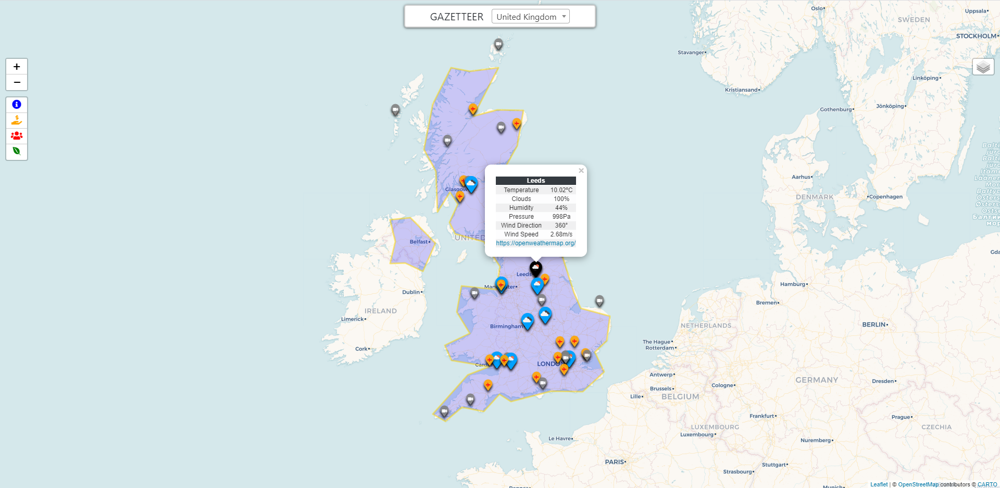

# GAZETTER
> A "mobile first" website. It makes use of third party APIs, which provide profiling for all countries through the presentation of demographic, climatic, geographical and other data.

## Table of contents
* [General info](#general-info)
* [Screenshots](#screenshots)
* [Technologies Used](#technologies-used)
* [How To Use](#how-to-use)
* [APIs Used](#apis-used)
* [API Call Example](#api-call-example)
* [Status](#status)
* [Demo](#demo)
* [Contact](#contact)

## General info
The program works so that every time you choose a country in the dropdown menu, it will update the map with the country border, and provide the user with detailed country information through the use of modals and map markers.

## Screenshots

## Technologies Used
* Html 5 and CSS
* Bootstrap 4.5.3
* JQuery 3.6.0
* PHP 7.4.12 and cURL
* Font Awesome [link](https://fontawesome.com/)
* Leaflet Maps 1.7.1 [link](https://leafletjs.com/)
* Leaflet Plugins
    * Easy Button  2.4.0 [link](https://github.com/CliffCloud/Leaflet.EasyButton)
    * Marker Cluster 1.4.1 [link](https://github.com/Leaflet/Leaflet.markercluster)
    * Grouped Layer Control 0.6.1 [link](https://github.com/ismyrnow/leaflet-groupedlayercontrol)
* Other plugins
    * Chart JS 3.2.1 [link](https://www.chartjs.org/)
    * Select2 4.1.0 [link](https://select2.org/)
    * Google Translate Tutotrial [link](https://www.w3schools.com/howto/howto_google_translate.asp)

## How To Use
Create a config.php file within the php folder. Then write the following code:

    `return array(
    'weatherApi' => '', // create an account at https://openweathermap.org/api to get an API key
    'webcamApi' => '', // create an account at https://api.windy.com/webcams to get an API key
    'openCageApi' => '', // create an account at https://opencagedata.com/ to get an API key
    'opentripmapApi' => '', // create an account at https://opentripmap.io/ to get an API key
    );`

## APIs Used
* Rest Countries [link](https://restcountries.eu/)
* OpenCage [link](https://opencagedata.com/)
* OpenWeather [link](https://openweathermap.org/api)
* World Bank [link](https://data.worldbank.org/)
* Windy Webcams [link](https://api.windy.com/webcams)
* Opentripmap [link](https://opentripmap.io/)
* OSM-world-airports [link](https://babel.opendatasoft.com/explore/dataset/osm-world-airports/information/)
* Geonames Cities [link](https://public.opendatasoft.com/explore/dataset/geonames-all-cities-with-a-population-1000/information/?disjunctive.country)

## API Call Example
* JS:
    Via an ajax call to the PHP server, data (in this case the latitude and longitude) is sent to retrieve the API data (isocode), which in turn calls a function (changing the country in the dropdown menu).

        `function latLngToIso(latitude, longitude) {
        $.ajax({
            url:"php/getApis.php",
            type: 'POST',
            data: {
                lat: latitude,
                lng: longitude,
            },
            success: function(result) {
                console.log(result);
        
                // CHANGE DROPDOWN VALUE
                $('#countriesDropdown').val(result).change();
        
            },
            error: function(jqXHR, textStatus, errorThrown) {
                console.log('latLngToIso error')
            }
        });
        }`
    
* PHP:
    The following code shows a generic call to an API using cURL. In this example the API call converts the latitude and longitude (from the ajax request before) to an isocode.
    
        `function apiCall($url) {

            //  START CURL
            $ch = curl_init();

            // CURL OPTIONS
            curl_setopt($ch, CURLOPT_SSL_VERIFYPEER, false);
            // RETURNS RESULT AS STRING
            curl_setopt($ch, CURLOPT_RETURNTRANSFER, true);
            // SET URL TO BE USED
            curl_setopt($ch, CURLOPT_URL, $url);

            // EXECUTE CURL
            $result = curl_exec($ch);

            // CLOSE CURL
            curl_close($ch);

            // DECODE DATA FOR MANIPULATION
            $decode = json_decode($result, true);

            // RETURN DATA
            return $decode;
        }
        
        // apiKey
        $apiKey = "ceaf93ee5f1b4333b994ddeda2110d75";
        // specific url
        $url = 'https://api.opencagedata.com/geocode/v1/json?q='.strval($_REQUEST['lat']).'+'.strval($_REQUEST['lng']).'&key='.$apiKey;
        // call generic curl func
        $apiData = apiCall($url);
        // data we want
        if (array_key_exists('ISO_3166-1_alpha-2', $apiData['results'][0]['components'])) {
            $output = $apiData['results'][0]['components']['ISO_3166-1_alpha-2'];
        } else {
            $output = "Not A Country";
        }
        
        header('Content-Type: application/json; charset=UTF-8');
        echo json_encode($output);`

    All the calls to APIs use this function to get data, but some of the data retrieved is more complex and requires further formatting before being sent back to the site as json. For Example:  
    
        `function getWorldBank($arr, $isocode) {

            // DATA WILL GO TO LATEST YEAR
            $endYear = date("Y");
            // ARRAY TO ADD RETURNED WB COUNTRY DATA
            $outputArray = [];

            // LOOP EACH WB ARRAY (3 in total)
            foreach ($arr as $mainKey => $value) {
                // JOIN AS SINGLE STRING (3 strings)
                $joinAsString = implode(";", $value);
                // CALLS WB API *3 WITH EACH STRING
                $url = 'https://api.worldbank.org/v2/country/'.strtolower($isocode).'/indicator/'.$joinAsString.'?per_page=800&source=2&date=1968:'.$endYear.'&format=json';
                $result = apiCall($url);
                // FORMAT USEFUL RESULT DATA
                for ($i=0; $i < count($result[1]); $i++) {
                    // json looks like this:
                    // Category ($mainKey) -> demographic ([$result[1][$i]['indicator']['value'])-> year ($result[1][$i]['date']) -> value ($result[1][$i]['value'])
                    //  eg economic -> gdp -> 2012 -> 250000
                    $outputArray[$mainKey][$result[1][$i]['indicator']['value']][$result[1][$i]['date']] = $result[1][$i]['value'];
                };
            };

            return $outputArray;

        };`
    
    This function accepts the arguements: 
    * **$arr** - a custom made array containing all the demographic data codes I want to ask the API for. 
    * **$isocode** - the country code sent from the site via ajax. 
    It then calls the function **apiCall** three times. This is beacause the world bank API has a limit on the amount of demographic data codes you can send in a request.
    
    It is then formatted into easy to read json and sent back to the site, which jquery can then display.  

## Status
Project is: _In Progress_, 

## Demo
Available to view at: [michaelbracey.co.uk](https://michaelbracey.co.uk/)

## Contact
Created by [@Mbrace1](https://github.com/Mbrace1)